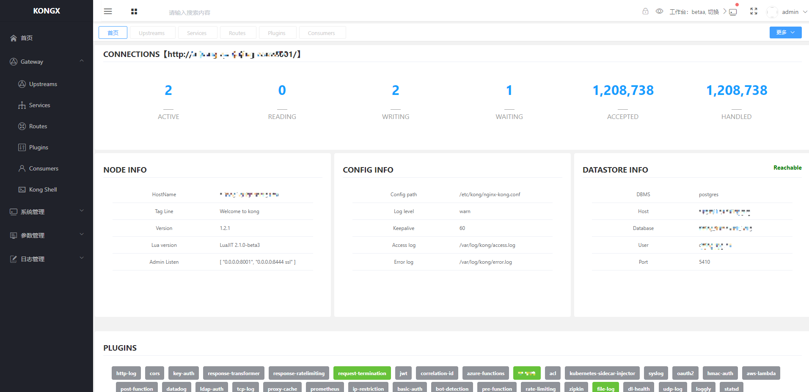

# kongx

kongx是网关kong的可视化界面管理平台(参考konga的部分界面布局方式)，能够集中化管理应用不同环境的网关配置，提供同步各环境的网关配置功能，并且具备规范的权限管理、参数配置、环境管理及日志审计等特性。

基于Spring Boot和Spring Cloud开发，打包后可以直接运行，不需要额外安装Tomcat等应用容器

Kongx 相关wiki文档请参考：[wiki](https://gitee.com/raoxy/kongx/wikis/Kongx?sort_id=2980225)

平台快速部署请参见[Quick Start](https://gitee.com/raoxy/kongx/wikis/pages?sort_id=2980215&doc_id=983590)

系统环境默认用户：admin/123456(部署登录后，请前往'个人设置'页面，及时修改密码)
#### Screenshots

#### Features

- Kong Manage:Upstream,Service,Route,Plugin,Consumer等
- 同步Kong配置:同步不同环境间的kong配置，便于多环境同一项目配置管理； 
- 系统管理:具有完善的权限管理系统，包括：用户管理、菜单管理、角色管理及用户组管理等功能；
- 参数管理:具有良好的扩展性，基于平台的参数管理可扩展多环境及服务管理；包括：环境管理、参数参数等
- 日志管理:平台具有完善的日志审计功能，包括：同步日志、操作日志；

#### Kong插件列表
- [官网插件](https://docs.konghq.com/hub/)
- [灰度插件canary](https://gitee.com/raoxy/kong-plugins-canary)
- [防攻击 kong_injection](https://github.com/ror6ax/kong_injection)

#### kong最佳实践

- Kong与consul自主发现服务
- 如何应用灰度插件(canary)及使用场景介绍
- kong插件开发实践
- 整理中...尽情期待